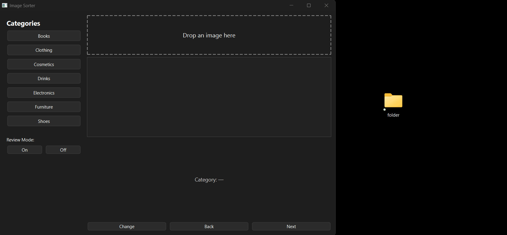

# Sorts images into a user-defined set of categories/directories. Uses an image classifier. 

<p float="left">
  <figure style="display:inline-block; margin-right:20px;">
    
    <figcaption>Assign categories image-by-image</figcaption>
  </figure>

  <figure style="display:inline-block;">
    
    <figcaption>With review mode off</figcaption>
  </figure>
</p>

<ul>
  <li><h3>Automatically classifies images</h3></li>
  <li><h3>Provides previews and predicted categories</h3></li>
  <li><h3>User override option</h3></li>
</ul>

# Installation: 
```bash
pip install -r requirements.txt
python main.py
```
